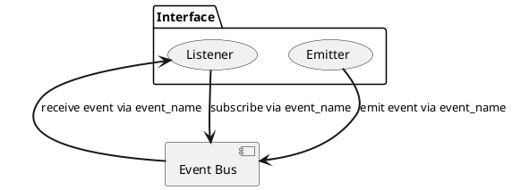
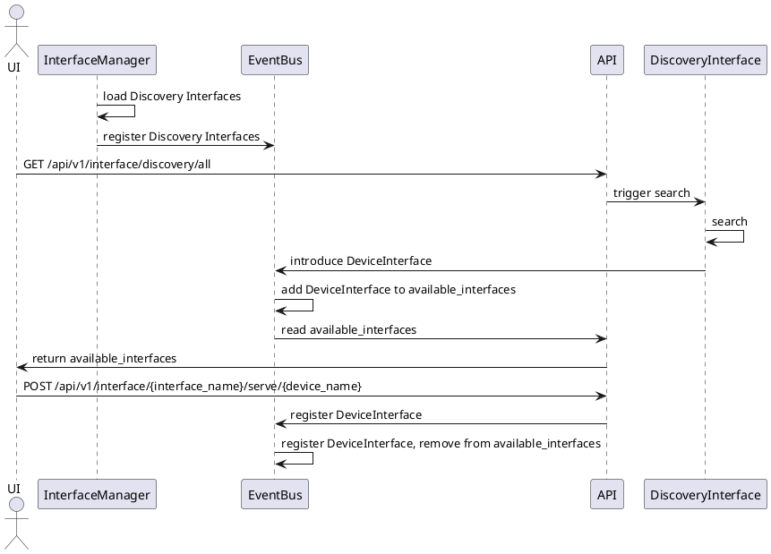
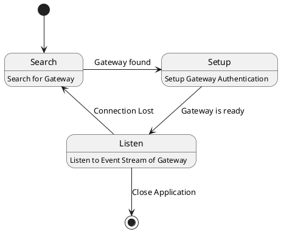
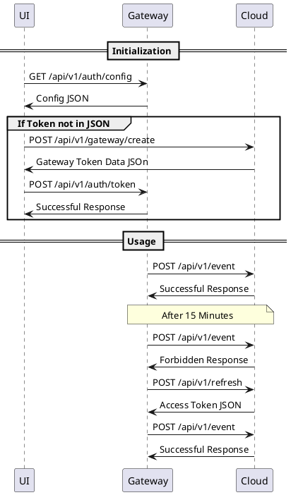
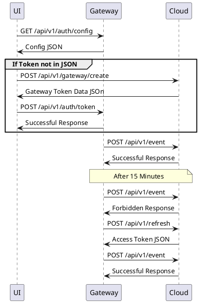

# Gateway Architecture

The gateway is supposed to be a data collection system for all compatible devices inside the customers' office.

The leading paradigm for the gateway is an Event Driven Architecture.

The gateway has one **singleton Event-Bus** which coordinates all Events of the system.
Components that can subscribe to and emit Events on the bus are called **Interface class** on this system.
The Event-Bus distributes all events in a publishing/subscribe fashion based on the event name.
The Interfaces can be run async, as thread, process or be called from the main thread.

## Interfaces

Most gateway functions are represented by an interface class.
There exist three main Interface Classes:

* System Interfaces
* Discovery Interfaces
* Device Interfaces

System Interfaces represent System Components that implement gateway logic that is not directly related to a device.
Each system interface exists therefore only once.

Discovery Interfaces implement components to discover devices on the network.
After a device is discovered, its matching device-interface is setup and introduced to the event-bus as beeing
available.

Device Interfaces represent devices and gather their information according to their protocol.



### System Interfaces

The SystemInterface **should require no parameter** in the class `__init__` method including the name parameter --> _
default name_.
If the class should be registered automatically during the startup, it needs to be imported in the package `__init__.py`
class and added to the `__all__`variable.

#### Interface Manager

The Interface Manager is a System Interface that is initialized even before the **EventBeforeLoad** is emitted.
Its purpose is to load all other Interfaces during the system startup.
Therefore, it subscribes to the **EventbeforeLoad** and registers all Core- and DiscoveryInterfaces once it is emitted.



### Discovery Interfaces

A Discovery Interface should be able to detect and spin of multiple device interfaces.
Therefore, this interface should require only one instance.
The DiscoveryInterface **should require no parameter** in the class `__init__` method including the name parameter --> _
default name_.
If the class should be registered automatically during the startup, it needs to be imported in the package `__init__.py`
class and added to the `__all__`variable.

### Device Interfaces

#### Device Interface Interface-Name

The device interface name gives the name of the interface and not of the representing device.
This name is used e.g. in the UI to present a picture of the given interface - and therefore needs to be in sync with
the other systems.

#### Device Interface Label

The device Interface label is the name that will be visible in the ui.
Therefore, the Device Interface Label should Label the Interface such that a user can recognize it.
It should be unique, however the recognizablility is more important than a proven uniqueness.
Therefore, sometimes the label converges from the name for a better ux.

#### Gateway ID

The Gateway ID is the unique Identifier for each Interface.
This ID is used to identify each Interface without the automatically generated ID of the cloud.
This enables to reference the interfaces even when the cloud is not available.

Good Sources for Gateway IDs are:

* Serial number of a device
* MAC address: Only obtain the MAC address from the device API or a discovery handler. Tools that rely on reading the
  arp cache or local network access such as getmac will not function in all supported network environments and are not
  acceptable.
* Unique identifier that is physically printed on the device or burned into an EEPROM

Sometimes acceptable sources for a Name for local devices

* Hostname: If a subset of the hostname contains one of the acceptable sources, this portion can be used

Unacceptable sources for a Name:

* IP Address
* Device Name
* Hostname
* URL

## Lifecycle Events

The system lifecycle and the corresponding Events orchestrate the processes of the software.
Each process once it is set up, listens for a certain Event to start its action and stops likewise if it does not
terminate on its own.

```plantuml
start 
:Init Database if not there;
:Generate UUID if not there;
:register InterfaceManager;
:register Core- and DiscoveryInterfaces;
note left: EventBeforeLoad
repeat 
:load config and Integrations;
note left: EventLoaded 
backward:Rollback;
repeat while (load successful?) is (no) not (yes)
note right: EventSetupRetry 
#palegreen:run;
note left: EventStart 
:stop all Integrations;
note left: EventBeforeStop 
:kill main thread;
note left: EventStop 
    stop
```

## Multithreading

The Gateway itself is started as daemon process. After the startup,
the Gateway starts all Sub-Services of the System as Thread. Afterwards,
the Gateway runs idle and only provides process context to the threads.
Once the CLI orders the Engine to stop, its important last job is to coordinate the stopping of all
Service Threads.

## API

### UI and Gateway Connection Flow

As soon as the UI-client is logged in,it sends a Broadcast Request every 5 seconds via the SSDP Protocol to find the
gateway.

The gateway listens for this request and responds according to SSDP.
Once the UI-Client has received this response, it stores the network address of the gateway.
It then checks if the Gateway is Setup and does so if not.
Afterwards he triggers the method to listen on the gateway Event Stream.
Once the client lost the connection of the gateway -> back.

UI States:



### Gateway Authentication Flow

Access Token invalidates after 15 Minutes and needs to be refreshed afterwards



### Server-Sent Event

The `/stream` path offers a possibility to listen for Events which should update the UI.
These Events contain data which are important to submit to the UI as quickly as possible to have a pleasant UX.
Therefore this data is not delivered via server requests.
Good examples for a suitable Event are status updates, or an Error message.

### Interface Discovery



### Device Discovery

All system network protocols continuously listen for new devices in the network.
Devices which continuously broadcast their information to a network, e.g.
their status, will be registered automatically.
Devices without a continuous discovery broadcast have to be called deliberately
from our system and are registered once they reply.
The system checks for every received messaged weather the sender is already known.
With this logic, the system can keep a registry of all available devices on the EventBus.

```plantuml
(*)  --> "Event"
If "Is Event sender registered on EventBus?" then
--> [No] "Register on EventBus"
-->(*)
else
-->(*)
Endif
```

Each registered device interface has the task to automatically monitor all the received data of the device.
But we register all devices we see on the network.
To avoid uploading too much data, interfaces have to be activated after they are registered.
With this system we know all devices on the network and can deliberately activate the monitoring of the devices in use.

## Limitations

The demonetization of the process execution is currently only possible on Unix-like systems.
Therefore, the software won't run on Windows. A automatic execution as a windows service (deamon equivalent) is planned.
