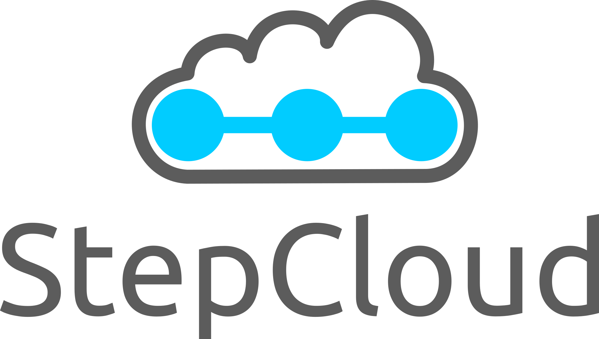

<!-- PROJECT LOGO -->
<br />
<div align="center">
  <a href="https://github.com/othneildrew/Best-README-Template">
    
  </a>

<h3 align="center">StepCloud</h3>

  <p align="center">
    Monorepo of a distributed system to monitor 3D Printing processes.
    <br />
    <a href="https://github.com/ErikBird/StepCloud"><strong>Explore the docs »</strong></a>
    <br />
    <br />
    <a href="https://github.com/ErikBird/StepCloud/issues">Report Bug</a>
    ·
    <a href="https://github.com/ErikBird/StepCloud/issues">Request Feature</a>
  </p>
</div>


<!-- TOC -->

* [About The Project](#about-the-project)
    * [System Overview](#system-overview)
    * [Supported Devices:](#supported-devices-)
    * [Built With](#built-with)
* [Getting Started](#getting-started)
    * [Prerequisites](#prerequisites)
    * [Installation](#installation)
        * [Default Login](#default-login)
        * [Server](#server)
        * [Gateway](#gateway)
* [Roadmap](#roadmap)
* [Contributing](#contributing)
    * [Code Standards](#code-standards)
        * [Commit Messages](#commit-messages)
        * [Releases](#releases)
* [Contact](#contact)

<!-- TOC -->

<!-- ABOUT THE PROJECT -->

## About The Project

⚠️⚠️ **StepCloud is currently not in active development. If you are interested in the project, please get in touch with
me.** ⚠️⚠️

![StepCloud Screen Shot][product-screenshot]

There exist plenty of QM Systems to support the additive manufacturing processes.
However, they are usually tailored to the specific needs of a big manufacturer.

StepCloud on the other hand is the simple and economical solution for smart manufacturing lines of small and
medium-sized businesses.
Since manufacturing lines are often composed by machines of different manufacturers and software systems, there exist no
central documentation.

Hence, fault detection or a comparison with the workflow blueprint is very time intense.

StepCloud enables to collect all workflow data just-in-time and document them comprehensively.
However, this is only the starting point for StepCloud.
Based on the collected data, StepCloud will serve as a virtual assistant to support you in the challenges of daily
manufacturing.

Current Features:

- [x] Gateway Detection
- [x] Device Discovery
- [x] Integrations for all (Core) Process Steps
- [x] Data Collection Pipeline
- [x] Data Visualization
- [x] Automatic Updates

### System Overview

The Stepcloud System has three components:

* **UI** to serve as interaction point with the customer,
* **Gateway** to continuously collect machine data and
* **Server** to persistently store all data in the cloud

![StepCloud System][system-overview]

### Supported Devices:

| Manufacturer |     Name      | Type               |
|--------------|:-------------:|--------------------|
| Nk-Optik     | Otoflash G171 | Curing Unit        |
| EMAG         |  Emmi-30 HC   | Ultrasonic Cleaner |
| Asiga        |   MAX UV385   | 3D Printer         |
| Asiga        |   MAX Mini    | 3D Printer         |
| Asiga        |  PRO 2 UV385  | 3D Printer         |
| Asiga        |   MAX UV365   | 3D Printer         |
| Asiga        | PRO 4K UV385  | 3D Printer         |

### Built With

* FastAPI
* VueJS
* Electron
* Axios
* JavaScript
* Python

## Getting Started

### Prerequisites

Please install:

* [Docker](https://www.docker.com/).
* [Docker Compose](https://docs.docker.com/compose/install/)
* [NodeJs](https://nodejs.org/en/)

### Installation

The Gateway as well as the Server can be run by Docker.
You can start the stack (Server + Gateway) via:

```bash
docker-compose up -d
```

At first, you need to migrate and initialize the cloud-database with:

```bash
docker-compose exec backend alembic upgrade head
docker-compose exec backend /bin/sh -c "python ./app/initial_data.py"
```

Afterwards you can start the UI to interact with the system:

```bash
npm --prefix ./UI/ install
npm --prefix ./UI/ run electron:serve
```

Afterwards you can reach them in the following way:

#### Default Login

**Username:** admin@stepcloud.de

**Password:** admin

#### Server

The server provides multiple REST Endpoints for each User-group. The OpenAPI Docs can be found here:

| API Group |              Link             |
|-----------|:-----------------------------:|
| User      |     http://localhost/docs     |
| Admin     |  http://localhost/admin/docs  |
| Gateway   | http://localhost/gateway/docs |

You can find the specific [Server Documentation](Server/README.md) in the Server folder.

#### Gateway

The gateway REST API can also be controlled via OpenAPI Docs at  http://localhost:7353/
You can find the specific [Gateway Documentation](Gateway/README.md) in the Gateway folder.

## Roadmap

- [ ] Upgrade Frontends to Vue3
- [ ] Adapt DevOps Pipelines to work for the Monorepo

## Contributing

If you have a suggestion that would make this better, please fork the repo and create a pull request. You can also
simply open an issue with the tag "enhancement".
Don't forget to give the project a star! Thanks again!

### Code Standards

#### Commit Messages

All commit messages should follow the **convential commit standard**. You can read about
it [here](https://www.conventionalcommits.org/).

#### Releases

I follow the **semver** Semantic Versioning Paradigm for the Release Names.

Given a version number MAJOR.MINOR.PATCH, increment the:

    MAJOR version when you make incompatible API changes,
    MINOR version when you add functionality in a backwards compatible manner, and
    PATCH version when you make backwards compatible bug fixes.

Additional labels for pre-release and build metadata are available as extensions to the MAJOR.MINOR.PATCH format.

You can read more about it [here](https://semver.org/).

<!-- CONTACT -->

## Contact

Erik Schwan - erikbird@erikschwan.de

Project Link: [https://github.com/ErikBird/StepCloud](https://github.com/ErikBird/StepCloud)

<p align="right">(<a href="#readme-top">back to top</a>)</p>

<!-- MARKDOWN LINKS & IMAGES -->
<!-- https://www.markdownguide.org/basic-syntax/#reference-style-links -->

[product-screenshot]: imgs/Screenshot.png

[system-overview]: imgs/StepCloudSystem.png

[Vue.js]: https://img.shields.io/badge/Vue.js-35495E?style=for-the-badge&logo=vuedotjs&logoColor=4FC08D

[Vue-url]: https://vuejs.org/