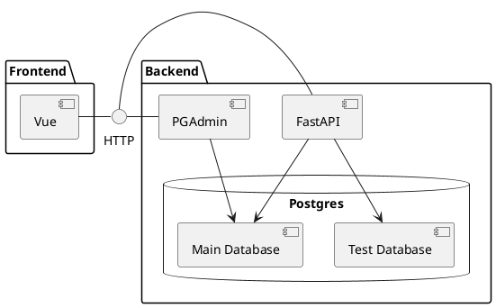

# StepCloud Server 🤖

The StepCloud Server provides the cloud infrastructure for the StepCloud IoT System.

## Setup

Please install:

* [Docker](https://www.docker.com/).
* [Docker Compose](https://docs.docker.com/compose/install/)

and start the stack via:

```bash
docker-compose up -d
```

Initialize the database via:

```bash
docker-compose exec backend alembic upgrade head
docker-compose exec backend /bin/sh -c "python ./app/initial_data.py"
```

The User API can then be explored at http://localhost/docs

The Admin API is available at http://localhost/admin/docs

The Gateway API is available at http://localhost/gateway/docs

## Architecture



The mein goal of this Project is to provide the cloud infrastructure.
Therefore the focus is the backend which can be accessed via a REST-Api.
The Frontend is at the moment not current and needs to be updated in the future
The Routing is done via Caddy.

## CI/CD

The documentation can be found [here](.github/README.md)

## Backend

The backend is based on [FastAPI](https://fastapi.tiangolo.com) with the Database Model & Typing provided
by [SQLModel](https://sqlmodel.tiangolo.com).

### API Design

The documentation can be found [here](backend/app/app/api/README.md)

### DATABASE Design

The documentation can be found [here](backend/app/app/db/README.md)

### CRUD Query Design

The documentation can be found [here](backend/app/app/crud/README.md)

### Database

The database is run by postgres with an async connection.
The general configuration is described [here](https://rogulski.it/blog/sqlalchemy-14-async-orm-with-fastapi/).

#### Test Database

The docker-compose has two databases concurrently because one is explicitly spin up for the tests.
There have been some issues with the rollback of the test when they failed.
Therefore, the test setup has been switched to a separate database.

#### Migrations

The migrations are provided by **alembic**.

Probably not needed: _To initialize the migrations (It needs to be configured afterwards):_

`docker-compose exec backend alembic init -t async migrations`

To upgrade the migration files to the current database schema:

`docker-compose exec backend alembic revision --autogenerate -m "label"` e.g. `"Add User"`

To upgrade the database to the migration files:

`docker-compose exec backend alembic upgrade head`

To insert the initial database values:

`docker-compose exec backend /bin/sh -c "python ./app/initial_data.py"`

### PyTests

All test can be run in docker by

`docker-compose exec -T backend /bin/sh -c pytest`

A special test can be run by file or folder given its path:

`docker-compose exec -T backend /bin/sh -c "pytest app/tests/api"`

However, it is more convenient to debug the tests via a remote interpreter of the IDE (VSCode/Pycharm) and run from the
IDE.

Currently there exists and issue with the simulation of the testclient.
It looks like the API tests work with a different database then the CRUD Client.
This behaviour can be seen in `test_admin_api_users.py:test_create_user_new_email`.

## Admin View

Admin View should be automatically generated for all CRUD Actions. It is already implemented but the authentication is
still lacking.
Therefore it has been deprioritized and will be done once the documentation has been improved.
Alternative Project is https://aminalaee.github.io/sqladmin/

## Common Programming Problems

### Wrong AsyncSession import

The import should be

`from sqlmodel.ext.asyncio.session import AsyncSession`
with a query execution:
`db.exec()`

**NOT**

~~`from sqlalchemy.ext.asyncio import AsyncSession` and `db.execute()`~~

### get() got multiple values for argument 'id'

I changed the order of the arguments in the method signature once therefore the database gets the wrong paramerter.

**Fix:**
Make all Parameter Argument mapping explicit e.g.: get(db=db, id=int(user_id))

# Common Commands

## Docker-Compose

Description | Command
---|---
create and start containers | `docker-compose up`
start container after rebuild | `docker-compose up -d --build`
start services with detached mode |`docker-compose -d up`
start specific service |`docker-compose up <service-name>`
list images |`docker-compose images`
list containers |`docker-compose ps`
start services |`docker-compose start`
stop services |`docker-compose stop`
display running containers |`docker-compose top`
kill services |`docker-compose kill`
remove stopped containers |`docker-compose rm`
stop containers |`sudo docker-compose down`
stop containers and database |`sudo docker-compose down -v`
clean up any resources |`docker system prune`

## Docker-Compose Backend

Description | Command
---|---
see backend logs | `docker-compose logs backend`
follow backend logs  | `docker-compose logs -f backend`
follow after last backend logs  | `docker-compose logs -f --tail 10 backend`
connect to backend shell|`docker-compose exec -it backend /bin/sh`
export data from backend container | `docker export backend > export.tar`

# Authentication

- Two different authentication mechanisms.
- User Credientials or Auth Token.
- User sets up token for the gateway.
- Gateway has access and refresh token to avoid re-login (user interaction)

## Technical details about the JWT "subject" sub

The JWT specification says that there's a key sub, with the subject of the token.

It's optional to use it, but that's where we put either the user id or the gateway id for identification depending on
the token type.

This difference is more convenient for the developer since the information is taylored to the sending entity.
Therefore it is easier to limit the scope of interaction and check for validity of the sended data. (Check if the data
id are the same as the authentication ones)

## Left out

It is important to have some form of token invalidation (Blacklist). Usually that is done by a block list on the server
cache.
Since the matter is not important yet, it will be postponed but is very important to have at some point.

The refresh token atm expires after 5 years. This is setup since I had no uncomplicated way to solve the fproblem of
refresh_token expiration.
Should be improved for more security.