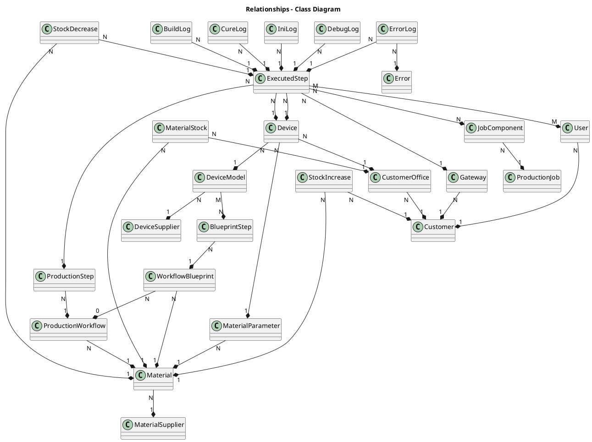

```plantuml
@startuml

title Relationships - Class Diagram


class Material
class MaterialSupplier
class MaterialStock
class StockIncrease
class StockDecrease
class MaterialParameter 
class User
class Customer 
class CustomerOffice
class Device
class DeviceModel
class DeviceSupplier
class BlueprintStep
class WorkflowBlueprint
class ExecutedStep
class ProductionStep
class JobComponent
class ProductionJob
class CureLog
class BuildLog
class IniLog
class DebugLog
class ErrorLog
class Error 
class Gateway 

MaterialSupplier "1" *-up- "N" Material
Material "1" *-up- "N" MaterialParameter
Material "1" *-up- "N" MaterialStock
Material "1" *-up- "N" StockIncrease
Material "1" *-up- "N" StockDecrease
ExecutedStep "1" *-up- "N" CureLog
ExecutedStep "1" *-up- "N" BuildLog
ExecutedStep "1" *-up- "N" DebugLog
ExecutedStep "1" *-up- "N" ErrorLog
ExecutedStep "1" *-up- "N" IniLog
Error "1" *-up- "N" ErrorLog
ProductionStep "1" *-up- "N" ExecutedStep
Device "1" *-up- "N" ExecutedStep
User "M" *-up- "N" ExecutedStep
ExecutedStep "1" *-up- "N" StockDecrease
Customer "1" *-up- "N" StockIncrease
Customer "1" *-up- "N" User
Customer "1" *-up- "N" CustomerOffice
CustomerOffice "1" *-up- "N" Device
Gateway "1" *-up- "N" ExecutedStep
Device "1" *-up- "N" ExecutedStep
MaterialParameter "1" *-up- "N" Device
CustomerOffice "1" *-up- "N" MaterialStock
WorkflowBlueprint "1" *-up- "N" BlueprintStep
DeviceSupplier "1" *-up- "N" DeviceModel
DeviceModel "1" *-up- "N" Device
ProductionWorkflow "0" *-up- "N" WorkflowBlueprint
Material "1" *-up- "N" WorkflowBlueprint
BlueprintStep "N" *-up- "M" DeviceModel
JobComponent "N" *-up- "M" ExecutedStep
ProductionJob "1" *-up- "N" JobComponent
Material "1" *-up- "N" ProductionWorkflow
ProductionWorkflow "1" *-up- "N" ProductionStep
Customer "1" *-up- "N" Gateway


@enduml
```