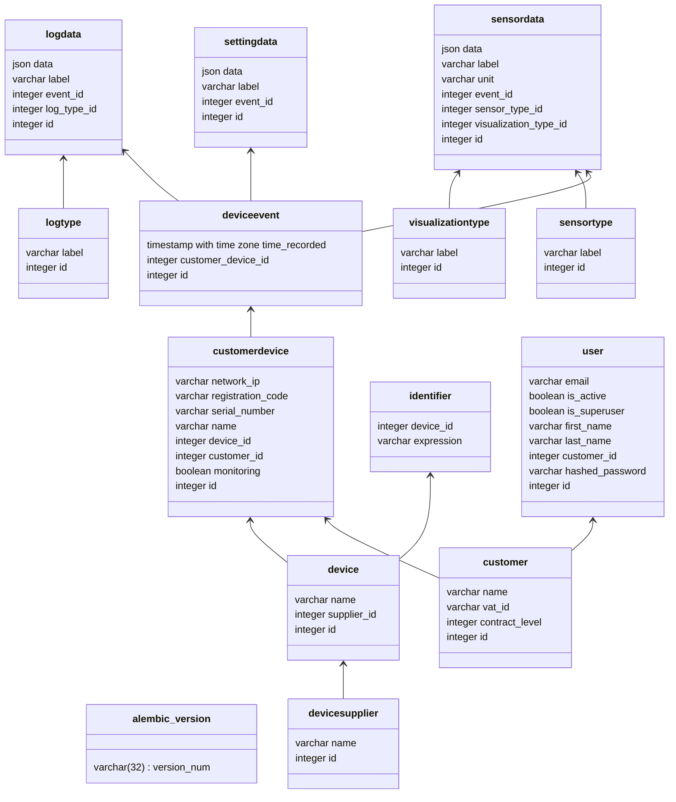

# Databse Design

## Reasoning

### User

The user e-mail has to be unique to query easily for a login.

## Inspiration

https://towardsdatascience.com/building-and-leveraging-an-event-based-data-model-for-analyzing-online-data-c166c523fe6a
https://medium.com/@tobyhede/event-sourcing-with-postgresql-28c5e8f211a2
https://softwaremill.com/implementing-event-sourcing-using-a-relational-database/
